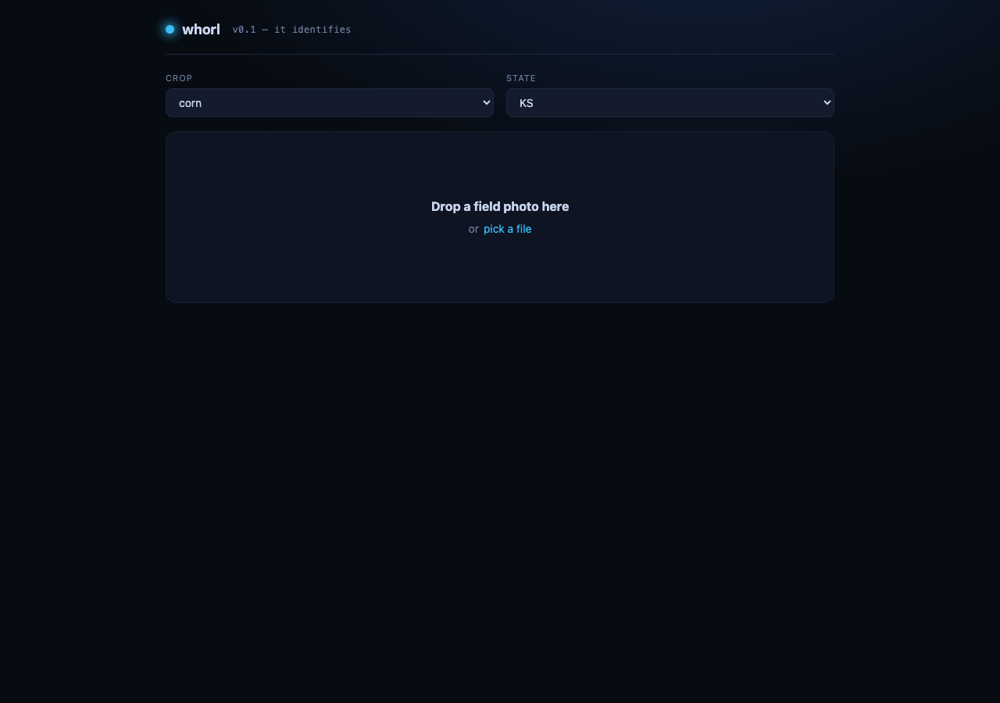

<h1 align="center">whorl</h1>

  <b>An open-source crop-scouting dashboard.</b> 
  Photo of a pest in. Cited recommendation out. Under 30 seconds. 
  Built by a PhD entomologist for Midwest farmers and crop consultants.

  <i>🚧 Building in public. Follow along — releases land in stages (see the <a href="ROADMAP.md">roadmap</a>).</i>

  

v0.1 — drop a field photo, get a structured pest identification with confidence and lifecycle stage. Recommendations + citations land in v0.3.

---

## What it does

A farmer or independent crop consultant drops a phone photo of a pest, disease, or crop damage into the dashboard, picks the field it came from, and in under 30 seconds gets:

- A **scientific identification** with confidence + lifecycle stage
- The **regional economic-injury threshold** cited to extension publications by paragraph
- A **plain-English action recommendation** — including IRAC / FRAC / HRAC mode-of-action rotation against the field's recent applications history
- At least one **biological / cultural / mechanical alternative** when one exists for the pest × crop × stage
- **REI and PHI** from EPA PPLS for any chemical recommendation
- The **weather window** for treatment from NWS / Kansas Mesonet / OpenMeteo

## Status

| Tag | Name | Status |
|---|---|---|
| **v0.1** | *It identifies* | ✅ shipped |
| **v0.2** | *It knows the field* | ✅ shipped |
| **v0.3** | *It recommends* | ✅ shipped |
| **v0.4** | *It watches the sky* | ✅ shipped |
| **v0.5** | *It streams live* | ✅ shipped |
| **v1.0** | *Launch* | ✅ shipped |

See [`ROADMAP.md`](ROADMAP.md) for the staged release plan.

## Architecture

- **Backend**: FastAPI + async, served by uvicorn, deployed via systemd + Caddy on an IONOS VPS
- **Database**: self-hosted Postgres 16 + pgvector (v0.2+)
- **Vision + reasoning**: Qwen3-VL via OpenRouter (Gemini Flash fallback)
- **Knowledge base**: LLM-curated markdown wiki ([Karpathy `llm-wiki` pattern](https://gist.github.com/karpathy/442a6bf555914893e9891c11519de94f)) over immutable raw sources — KSU MF742–MF810, IRAC v11.1, FRAC 2024, HRAC, EPA PPLS API, Cornell NYS IPM biocontrol, ATTRA, IPM Centers, iNat, GBIF
- **Recommender enforces** MOA rotation against the field's `applications` history, surfaces ≥1 non-chemical alternative per `treat` action, respects REI / PHI, prefers selective products when beneficials are visible
- **Frontend**: React + Vite + TypeScript
- **License**: AGPL-3.0

## Built by

[Paul Bergeron](https://github.com/pb-commits-it) — PhD ecology / entomology / agriculture, then a pivot into AI / agent-infrastructure engineering.

## License

[AGPL-3.0](LICENSE). Closed-source hosted services running modified versions must publish their changes.
